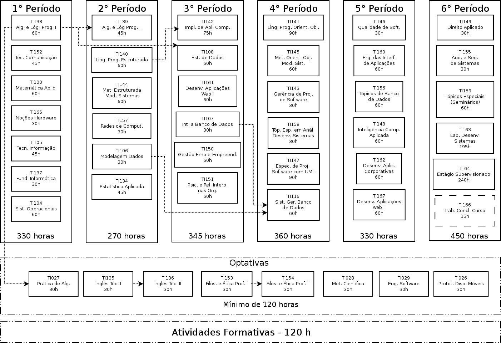

:title: Data Warehouse
:author: Everaldo Gomes
:description: 18/03/2015 - UFPR - Tecnologias de Informação - Data Warehouse
:css: css/custom.css

----

TI105 - Tecnologias de Informação - Data Warehouse
==================================================
Everaldo Gomes - 18/03/2015
---------------------------

----

Data Warehouse (*Armazém de Dados*)
===================================

----

Contexto (Problema)
===================

* Sistemas de Informação auxiliam as organizações a atingirem seus objetivos:

    #. resolver problemas;
    #. entregar valor ao cliente;

* Os Sistemas de Informação Transacional resolvem apenas os problemas a nível operacional;

----

Contexto (Solução)
==================

* Data Warehouse (DW) é um grande banco de dados que fornece informações concisas, confiáveis e integradas para auxiliar na resolução
  de problemas a nível gerencial (tomadores de decisões táticas e estratégicas). 

* Evolução dos Sistemas de Apoio à Decisão

----

Contexto (Disciplina)
========================================================

----

----

Data Warehouse (composição)
===========================

* Dados de diversas fontes, inclusive, e principalmente, sistemas legados:
    #. bancos de dados hierárquicos;
    #. arquivos planos;
    #. planilhas;
    #. bancos de dados de diversos Departamentos;
    #. bancos de dados externos (e.g. base de dados dos Correios, IBGE).

----

Data Warehouse (objetivos)
===========================

* Geração de informações integradas, através da inserção de dados consolidados;

* Armazenar dados correntes e históricos de potencial interesse para os tomadores de decisão;

* Geração de relatórios simplificados;

* Possibilita a descoberta de tendências e padrões.

----

Exemplos!!!
===========

* Um DW pode reunir dados dos Sistemas de Vendas, Manufatura, Compras e Contabilidade

----

Mais Exemplos!!!!
=================

* Reunião de dados de sistemas legados (Estudo de Caso da Receita Federal Norte-Americana,
  livro **Sistema de Informação Gerenciais**)

----

Data Mart
=========

* Subconjunto de um Data Warehouse;

* Atende apenas um Departamento (população específica de usuários);

* Pode ser montado com mais rapidez e menor custo

----

Data Warehouse (Características)
================================

* Armazena informações históricas (geralmente entre 5 a 10 anos);

* Somente consulta (não é atualizado em tempo real);

* Transformação de dados;

* Limpeza de dados (somente dados consolidados - não são inseridos registros inválidos).

----

Data Warehouse (Resumo do Processo)
===================================

* Extração dos Dados;

* Limpeza dos Dados;

* Transformação dos Dados;

* Carregamento dos Dados;

* Consulta dos Dados (análise gerencial).

----

Mais exemplos de Aplicações
===========================

* Comércio Eletrônico (Amazon, Submarino, Saraiva etc.);

* Operadora de Telefonia (VIVO)

* ANVISA (avaliação das áreas de atuação)

----

Dúvidas????
===========
----

* Todas as empresas podem implantar um Data Warehouse?

* Por que as empresas não usam o próprio Sistema Transacional para implementar as consultas?

----

Big Data
========

* Grande volume de dados ("megadados")

* 5 Vs: velocidade, volume, variedade, veracidade e valor

* Presente principalmente em sites, sistemas web e coleta de dados
  fornecidos por sensores (GPS, temperatura etc.)

----

Big Data vs. Data Warehouse
===========================

* Big Data é uma Aplicação

* Data Warehouse é uma Arquitetura

----

Big Data vs. Data Warehouse
===========================

* Big Data permite lidar com grandes volumes de dados de forma escalável;

* Data Warehouse possui integridade dos dados e credibilidade corporativa.

----

Conclusões
=====================

* Data Warehouse é uma evolução dos Sistemas de Apoio à Decisão;

* Reúne dados de diversas fontes (informação **integrada**), correntes e históricos, internos
  e externos, de maneira consolidada;

* Auxilia na tomada de decisões gerenciais (estratégicas);

-----

Conclusões
=====================

* Fornece informação com credibilidade corporativa (diferença para Big Data);

* É um dos tipos de sistemas existentes nas organizações. Todos colaboram para 
  que elas atingam seus objetivos. Esse atua em nível gerencial.

* Data Marts podem ser utilizados para reduzir os custos, ter mais rapidez na implantação
  e atender um público específico.

----

Lista de Exercícios!!!!!!
=========================
----

Referências Bibliográficas
===========================

STAIR, Ralph M.Princípios de Sistemas de Informação: Uma Abordagem Gerencial. Rio de Janeiro  Editora LTC, 4ª edição, 2002.

LAUDON, Kenneth C & Laudon, Jane P. Sistemas de Informação Gerenciais Rio de Janeiro Editora LTC, 9ª edição, 2014.

REZENDE, Denis A.; Abreu, Aline F. de Tecnologia da Informação Aplicada a Sistemas de Informação  Empresariais São Paulo Atlas, 9ª edição, 2013

----

Referências Bibliográficas
===========================

Big Data Implementation vs. Data Warehousing –

http://www.b-eye-network.com/view/17017- Acessado em 17 de Março de 2015

Comparação Data Warehouse com Big Data - http://pt.wikipedia.org/wiki/

Big_data#Compara.C3.A7.C3.A3o_Data_Warehouse_com_Big_Data 

– Acessado em 17 de Março de 2015

----

Referências Bibliográficas
===========================

Thinking about Big Data - http://martinfowler.com/articles/bigData/ - Acessado em 17 de Março de 2015

